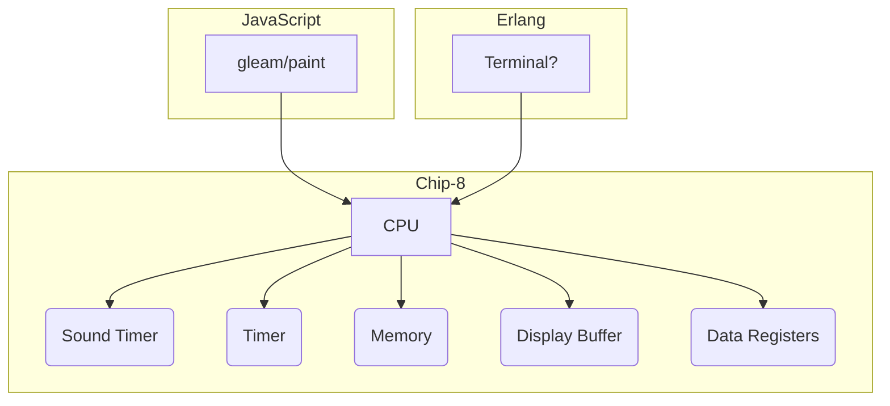

# CHIP-8

CHIP-8 is an interpreted programming language, designed in the 1970s to be to be run across many different microcomputers rather than any one particular architecture.

This is my idiomatic implementation of the language, targeting both JavaScript & Erlang compile targets.

Sources:
- [Chip-8 Technical Reference](https://github.com/mattmikolay/chip-8/wiki/CHIP%E2%80%908-Technical-Reference)
- [Guide to make a CHIP-8 Emulator](https://tobiasvl.github.io/blog/write-a-chip-8-emulator/)


# To Run Locally (In Progress)
```sh
gleam run
```

To test call `./starttest`

# Architecture (Planned)
The CHIP-8 is a pure data structure, which either the JS or Erlang runtimes hook in to, calling the tick() function at regular intervals and providing details about external state.


