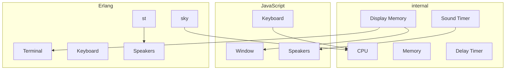

# CHIP-8

CHIP-8 is an interpreted programming language, designed in the 1970s to be to be run across many different microcomputers rather than any one particular architecture.

This is my idiomatic implementation of the language, targeting both JavaScript & Erlang compile targets.

Sources:
- [Chip-8 Technical Reference](https://github.com/mattmikolay/chip-8/wiki/CHIP%E2%80%908-Technical-Reference)


# To Run Locally (In Progress)
```sh
gleam run
```

# Architecture (Planned)

